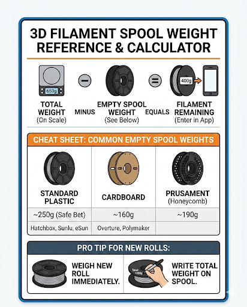

# 3D Print Shop Manager 🚀 (v14.1)

**The "All-in-One" ERP tool for 3D printing businesses and hobbyists.**

Stop guessing your prices. Stop failing prints. Stop losing track of your inventory.

This Python application combines a **Business Manager** (Inventory, Quoting, Receipts) with a **Field Manual** (Maintenance, Digital Reference Guide). It features multi-user **Cloud Sync**, automatic **Data Backups**, and a built-in **Auto-Updater**.

 
*(Note: Replace 'spool_reference.png' with a screenshot of your dashboard if you have one, otherwise remove this line)*

--

## ✨ Key Features

### 🛡️ Stability & Safety (New in v14.1)
* **Auto-Backup System:** Every time the app launches, it silently backs up your inventory and sales history to a local `.zip` archive.
* **Inventory Guardrails:** Prevents accidental "Negative Inventory" by warning you if a job exceeds remaining spool weight.
* **Resilient Queue:** Allows "Force Completion" of jobs even if the original spool data was deleted, ensuring your revenue stats stay accurate.

### 💰 Business Management
* **Smart Calculator:** Calculates exact print costs based on material weight, machine time ($/hr), labor, and electricity.
* **Sticky Settings:** Remembers your Markup (e.g., 2.5x) and Labor Rate between sessions.
* **Detailed Receipts:** Generates professional text-based invoices or donation receipts for tax write-offs.
* **Profit Analytics:** Interactive bar chart showing monthly net profit.

### 🎨 Visual Inventory
* **Color Swatches:** Dynamic colored dots for every spool makes scanning your shelf easy.
* **Benchy Status:** Clearly marks which spools have a printed "Benchy" sample (`✅ Yes` / `❌ No`).
* **Sortable Columns:** Click any header to sort by Weight, Material, or Cost.

### 📚 Digital Field Manual
* **Filament Guide:** A searchable table of Nozzle Temps, Bed Temps, and Fan Speeds for PLA, PETG, TPU, ABS, and Nylon.
* **Dynamic Gallery:** Drop any image (`ref_*.png`) into the folder, and it automatically appears as a new tab in the app (great for calibration charts).

--

## 🚀 How to Install & Use

### Option 1: The Easy Way (.exe)
*Recommended for End Users*
1.  Download `PrintShopManager.exe` from the [Releases Page](../../releases).
2.  Double-click to run. (No installation required).
3.  **Data Storage:** On first run, the app will create a data folder in your user profile. You can change this to OneDrive/Dropbox in the "Dashboard" tab.

### Option 2: Run from Source (Python)
*Recommended for Developers*
1.  Clone this repository.
2.  Install the dependencies:
    ```bash
    pip install -r requirements.txt
    ```
3.  Run the script:
    ```bash
    python print_manager.py
    ```

--

## 📂 Configuration & Data Sync
This app is designed to work across multiple computers (e.g., Workshop PC and Office Laptop).

1.  **Set Data Folder:** Go to **🏠 Dashboard** -> **System Actions** -> **📂 Set Data Folder**.
2.  **Select Cloud Folder:** Choose a folder in your **OneDrive**, **Google Drive**, or **Dropbox**.
3.  **Restart:** The app will now read/write `filament_inventory.json` from that cloud folder.

**Privacy Note:** The application separates *Code* from *Data*. Your inventory and sales history are stored in local JSON files and are **never** uploaded to GitHub.

--

## 🛠️ Requirements
* Python 3.x
* `ttkbootstrap` (Theme: Flatly/Darkly)
* `Pillow` (Image processing)
* `matplotlib` (Graphing)

--

## 📜 Changelog
* **v14.1:** Added Auto-Backups, Negative Inventory Warnings, and Queue hardening.
* **v13.9:** Added Digital Filament Guide and Dynamic Reference Gallery.
* **v13.6:** Split Inventory columns into Visual Swatches and Text.
* **v13.5:** Added Matplotlib Analytics.

--

*Created by Mobius457 for the 3D Printing Community.*